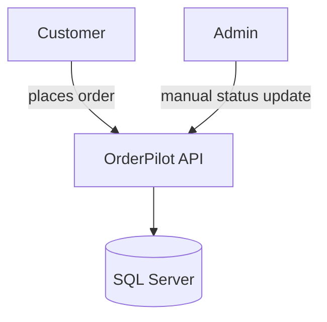
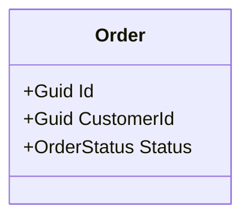
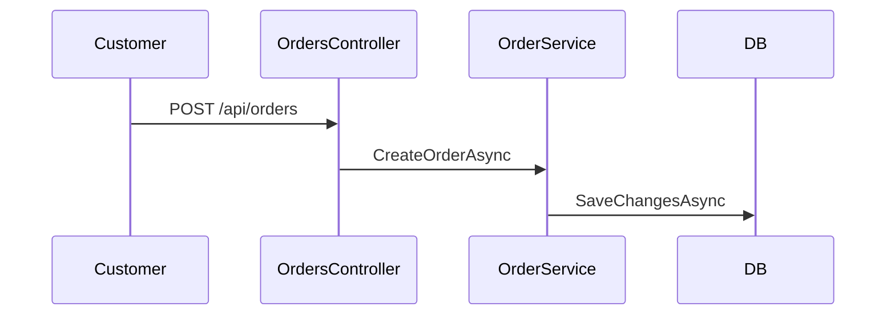

# ArchitectureReview

Design-stage gate between `/PRDFeasibility` and `/ImplementFeature`. Produces a reviewed architecture design and ADRs before code is written, so design mismatches are caught before implementation rather than after.

## Purpose

Closes the gap between "feasibility says proceed" and "code gets written." Produces a component/data-model/API design traced to the PRD's ID-tagged acceptance criteria, a system-level HLD diagram, and ADRs for major decisions — explicitly surfacing any decision that's still open rather than letting implementation start on an assumption. Can also run in `conformance` mode after implementation to check for drift, or in `lld` mode to produce per-module class/sequence diagrams (grounded in real code when it exists).

## Arguments

- `prd`: PRD identifier — feature slug or Linear Initiative ID (required)
- `decisions`: Architecture decisions already made, to incorporate directly instead of re-asking (optional, e.g. `decisions="stack=ASP.NET Core + SQL Server; auth=JWT + Identity"`)
- `mode`: `design` (default) — produce a new architecture design + HLD | `conformance` — compare existing code against the previously approved design | `lld` — produce per-module low-level diagrams
- `modules`: For `lld` mode, which modules to diagram (optional, comma-separated — defaults to all components in the design/implementation)
- `implementationPaths`: For `lld` mode, source paths to ground diagrams in (optional — if the PRD's status indicates an implementation exists, this is inferred automatically from the repo's `src/`)

## Execution

### `design` mode (default)

1. Load PRD from `/docs/planning/prds/{prd}.md`
   - Verify PRD status is `feasibility-assessed` or later
   - Load its enrichment and feasibility reports for risk flags and constraints

2. Invoke `architecture-review.design` task
   - Extracts ID-tagged acceptance criteria as traceability targets
   - Incorporates any `decisions` supplied
   - Identifies remaining open architecture decisions

3. If open decisions remain and were not supplied via `decisions`
   - Ask the user directly, the same way `/PRDIntake`/`/PRDValidate` surface questions for the PO
   - Do **not** proceed to write the design with an invented decision

4. Generate the architecture design, a system-level HLD (Mermaid diagram — components blocked by an open decision are drawn and labeled `TBD`, never omitted), ADRs, and requirement-traceability table via the `architecture-reviewer` agent

5. Score approval status
   - If `NEEDS_DECISIONS`: halt, surface the open questions, do not mark the PRD ready for implementation
   - If `APPROVED`: proceed to store the report and update PRD status

6. Store report in `/docs/planning/prds/{prd}-architecture.md`
   - Update PRD status to `architecture-approved` (or leave at `architecture-review` if decisions are still pending)
   - Link the report in PRD frontmatter

### `conformance` mode

1. Load the PRD and its previously approved architecture doc (if none exists, fall back to diffing directly against the PRD's acceptance criteria)
2. Invoke `architecture-review.checkConformance` task, scanning the actual codebase
3. Report drift findings: requirements whose acceptance criteria no longer match what was built
4. Recommend either a PRD update or a code fix per finding — do not assume which side is correct without checking whether the divergence was a deliberate decision

### `lld` mode

1. Load the PRD's architecture design (from a prior `design` run) for its component list; if none exists, use the PRD's functional requirements directly
2. Determine whether an implementation exists (PRD status `architecture-approved` with a linked codebase, or `implementationPaths` supplied) — if so, ground every diagram in the real source, never in the module's name alone
3. Invoke `architecture-review.generateLLD` task for the requested `modules` (or all)
4. For each module: produce a Mermaid class diagram (data/domain shape) and, where it has a primary flow, a Mermaid sequence diagram
5. Skip — do not invent — any module with neither source nor a design description
6. Store per-module diagrams in `/docs/planning/prds/{prd}-lld.md`, one section per module, each labeled `grounded in <path>` or `proposed, pre-implementation`

## Prerequisites

- PRD feasibility-assessed via `/PRDFeasibility` (status: `feasibility-assessed` or later)
- `.claude/tasks/architecture-review.md` task definition available
- For `conformance` mode: implementation code exists to scan
- For `lld` mode: an architecture design exists (`design` mode run first), or the PRD's functional requirements are specific enough to identify modules

## Output Files

- `/docs/planning/prds/{prd}-architecture.md` (architecture design, HLD, and ADRs, `design` mode)
- `/docs/planning/prds/{prd}.md` (updated status in frontmatter, `design` mode)
- `/docs/planning/prds/{prd}-architecture-conformance-{date}.md` (drift report, `conformance` mode)
- `/docs/planning/prds/{prd}-lld.md` (per-module class/sequence diagrams, `lld` mode)

## Output Format

````
### Architecture Review: {prd}
Mode: design

### Approval Status: APPROVED

### High-Level Design (HLD)


### Architecture Design
{component breakdown, data model, API surface}

### ADRs
1. **ADR-001: {decision title}**
   - Decision: ...
   - Alternatives considered: ...
   - Consequences: ...

### Requirement Traceability
| ID | Design Element | Status |
|----|-----------------|--------|
| PP-001 | OrderService.CreateOrderAsync | Satisfied |

### Risks
- HIGH: ...

### Recommendation
Ready for /ImplementFeature.
````

`lld` mode output, one section per module:

````
### Architecture Review: {prd}
Mode: lld

### Module: OrderService
Grounded in: src/OrderPilot.Api/Services/OrderService.cs




````

## Example

```
/ArchitectureReview prd="order-placement-pilot"
```

```
/ArchitectureReview prd="order-placement-pilot" decisions="auth=JWT + Identity; status-updates=Admin-managed, no supplier integration"
```

```
/ArchitectureReview prd="order-placement-pilot" mode="conformance"
```

```
/ArchitectureReview prd="order-placement-pilot" mode="lld"
```

```
/ArchitectureReview prd="order-placement-pilot" mode="lld" modules="OrderService,AdminConfigService"
```

## Related

- `/PRDFeasibility` - Run before this command; provides the constraints this review checks against
- `/PRDEnrich` - Provides the risk flags and patterns this review builds on
- `/ImplementFeature` - Run after this command; should consume the approved design instead of re-deciding architecture ad hoc
- `/ReviewCode` - Post-implementation code review; `conformance` mode here complements it by checking design-level drift, not just code quality

## Tasks Invoked

- `architecture-review.design` (produces the HLD as part of design mode)
- `architecture-review.checkConformance` (conformance mode only)
- `architecture-review.generateLLD` (lld mode only)
- `architecture-review.generateHLD` (standalone HLD refresh, not used by the default flows above but available if the design changes without a full re-review)

## Agents Used

- `architecture-reviewer` - Architecture design, HLD/LLD diagram generation, ADR generation, and requirement traceability
