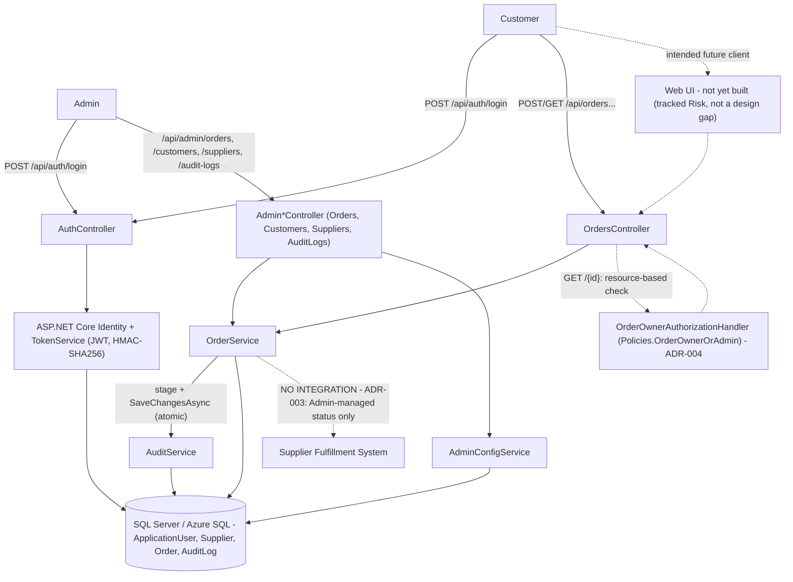

# Architecture Review: order-placement-pilot
Mode: design

> **This is a retroactive/backfill review.** `order-placement-pilot` was implemented before `/ArchitectureReview` existed as a command, so there was no pre-implementation design gate for it to pass through. This document does not gate anything — the code in `src/OrderPilot.Api` already exists and already shipped. Its job is to produce, after the fact, the ADR-backed architecture doc that *should have* existed before implementation, using the real code as ground truth, so this PRD has a proper baseline for future `/ArchitectureReview mode="conformance"` runs instead of none at all. A conformance check (`order-placement-pilot-architecture-conformance-2026-07-26.md`) already ran directly against the PRD's acceptance criteria (the fallback path, since no design doc existed) and found **no drift** across PP-001–PP-005. This document takes that verified fact as given rather than re-deriving it, and additionally supplies the ADRs and traceability table that check had no prior design to diff against.

## Approval Status: APPROVED

No unresolved HIGH or Critical-severity item remains. The two items the enrichment/feasibility reports flagged as HIGH pre-implementation (PP-003 auth mechanism, customer/admin authorization boundary) were both resolved by explicit user decisions during the original `/ImplementFeature` session and are now built, tested, and conformance-verified. The two items that remain open (unbuilt customer-facing web UI, PP-002's `[DRAFT]` 60-second latency target) are Medium/Low per the Risks section below — see that section for the reasoning, not assumed here.

## High-Level Design (HLD)

Standalone HLD backfill (`architecture-review.generateHLD`) — no new design decisions are made here, only the diagram, drawn from the Components/Data Model/API Surface sections and ADRs below. Unlike the parent PRD's HLD, no box here is labeled `TBD`: this pilot's architecture is fully decided and conformance-verified, so every box reflects a settled decision. Two absences are drawn explicitly rather than omitted, because each is itself a headline architecture decision, not an oversight: no Supplier system integration exists at all (ADR-003 — Admin manages status manually), and no web UI exists yet in this repository (tracked risk, not a design gap — see Risks below).

## Architecture Design

### Components

| Component | Responsibility | PP-00x |
|---|---|---|
| `AuthController` (`Controllers/AuthController.cs`) | Username/password login against ASP.NET Identity; issues JWT; blocks login for inactive pilot customers | PP-003, PP-005 |
| `OrdersController` (`Controllers/OrdersController.cs`) | Customer-facing order creation and self-service status view; `[Authorize(Roles="Customer")]` at class level | PP-001, PP-002, PP-004 |
| `AdminOrdersController` (`Controllers/Admin/AdminOrdersController.cs`) | Admin-only cross-customer order listing and manual, sequential status advancement; `[Authorize(Roles="Admin")]` | PP-001, PP-002 |
| `AdminCustomersController` / `AdminSuppliersController` (`Controllers/Admin/`) | Admin-only CRUD for pilot cohort membership and single-active-supplier configuration, no code deploy required | PP-005 |
| `AdminAuditLogsController` (`Controllers/Admin/AdminAuditLogsController.cs`) | Admin-only read of the audit trail | PP-004 |
| `OrderService` (`Services/OrderService.cs`) | Order creation (resolves the single active supplier, validates the customer is pilot-active), customer-scoped and admin-scoped queries, sequential status-transition enforcement | PP-001, PP-002, PP-005 |
| `AdminConfigService` (`Services/AdminConfigService.cs`) | Customer/supplier CRUD, single-active-supplier invariant enforcement (`DeactivateAllSuppliersAsync`) | PP-005 |
| `AuditService` (`Services/AuditService.cs`) | Appends an audit row (who/what/when) on order creation and status change | PP-004 |
| `TokenService` (`Services/TokenService.cs`) | Issues signed JWT with `sub`/`NameIdentifier`/role claims | PP-003 |
| `OrderOwnerAuthorizationHandler` + `OrderOwnerRequirement` + `Policies.OrderOwnerOrAdmin` (`Authorization/`) | Resource-based authorization: succeeds for Admin, or for the customer who owns the order | PP-001, PP-002 |
| `DbSeeder` (`Data/Seed/DbSeeder.cs`) | Seeds `Admin`/`Customer` roles and an optional dev-only Admin account from config; never seeds pilot customers or suppliers | PP-005 |

### Data Model

| Entity | Key fields | Notes |
|---|---|---|
| `ApplicationUser` (extends `IdentityUser<Guid>`) | `CompanyName`, `IsPilotActive`, `CreatedAtUtc` | ASP.NET Identity table; `IsPilotActive` is the PP-005 cohort on/off switch, also enforced at login (`AuthController.cs:38-41`) and at order creation (`OrderService.cs:20-24`) |
| `Supplier` | `Name`, `Code` (unique), `IsActive` | Single-active-supplier invariant enforced in `AdminConfigService`, not by a DB constraint — see ADR-005 |
| `Order` | `CustomerId`, `SupplierId`, `OrderType` (constant `"Standard"`), `ProductDescription`, `Quantity`, `Notes`, `Status` (enum), `CreatedAtUtc`, `UpdatedAtUtc` | `Status` is a strictly sequential enum (`Submitted=0 → Accepted=1 → Fulfilled=2`); `OrderService.UpdateOrderStatusAsync` only allows `+1` transitions |
| `AuditLog` | `UserId`, `Action` (`OrderCreated`/`OrderStatusChanged`), `EntityType`, `EntityId`, `Details`, `TimestampUtc` | Append-only; written inside the same service call as the event it records, not via a separate pipeline |

Relationships: `Order` → `ApplicationUser` (customer, many-to-one), `Order` → `Supplier` (many-to-one, though only one supplier is ever active at a time by design), `AuditLog` → `ApplicationUser` (acting user, by ID only, no navigation property).

### API Surface

| Endpoint | Access | Component |
|---|---|---|
| `POST /api/auth/login` | Anonymous | `AuthController.Login` |
| `POST /api/orders` | Customer | `OrdersController.Create` → `OrderService.CreateOrderAsync` |
| `GET /api/orders` | Customer (own orders only) | `OrdersController.GetMine` → `OrderService.GetOrdersForCustomerAsync` |
| `GET /api/orders/{id}` | Customer (owner only, via `OrderOwnerOrAdmin` policy) | `OrdersController.GetById` |
| `GET /api/admin/orders?customerId=&status=` | Admin | `AdminOrdersController.GetAll` |
| `PATCH /api/admin/orders/{id}/status` | Admin | `AdminOrdersController.UpdateStatus` → `OrderService.UpdateOrderStatusAsync` |
| `GET/POST/PATCH /api/admin/customers` | Admin | `AdminCustomersController` |
| `GET/POST/PATCH /api/admin/suppliers` | Admin | `AdminSuppliersController` |
| `GET /api/admin/audit-logs` | Admin | `AdminAuditLogsController.GetAll` |

**Design note on layered authorization (verified against tests, not assumed):** `OrdersController` carries a class-level `[Authorize(Roles="Customer")]`, so an Admin caller is rejected with 403 before the resource-based `OrderOwnerOrAdmin` policy on `GetById` is ever evaluated — confirmed by `RoleGatingTests.Admin_HittingCustomerOrdersRoute_Returns403`. Admin instead reaches orders exclusively through the separate `AdminOrdersController` (`GET /api/admin/orders`, no per-row ownership check needed since the whole controller is Admin-gated). The `OrderOwnerAuthorizationHandler`'s `Admin` branch (`Authorization/OrderOwnerAuthorizationHandler.cs:12-16`) is therefore currently exercised only at the unit level (`OrderOwnerAuthorizationHandlerTests.Admin_AlwaysSucceeds_RegardlessOfOrderOwner`) rather than through the live HTTP pipeline. This is intentional defense-in-depth, not dead code or drift: the policy is correct and reusable if a future shared endpoint ever serves both roles, and removing it would weaken the design for no benefit. Documented here so a future reviewer does not mistake it for an inconsistency.

### Traced Design → Requirement Mapping
See Requirement Traceability table below.

## ADRs

1. **ADR-001: Stack — ASP.NET Core (.NET 8) + SQL Server/Azure SQL via EF Core**
   - Context: The PRD's Technical Context explicitly left the stack "inherited-but-undecided," stating either the ASP.NET/.NET/Azure/SQL Server path or a JS/TS/React/Node/Postgres path was sufficient, and that the choice "should be driven by team familiarity, not requirements" (enrichment: Codebase Pattern Analysis; feasibility Prerequisite #5: "decide day 1 based on team familiarity"). No functional requirement demanded a specific stack.
   - Decision: ASP.NET Core (.NET 8) Web API with EF Core against SQL Server/Azure SQL.
   - Alternatives considered: JS/TS + React + Node + Postgres (the PRD's stated alternative option); rejected on the same "team familiarity" basis the PRD itself invited, not on technical merit — nothing in PP-001–PP-005 requires .NET-specific capability.
   - Consequences: EF Core's LINQ-based query layer gives parameterized queries "for free" across every data-access path (`ApplicationDbContext`, `OrderService`, `AdminConfigService`), which is what let PP-004's "parameterized queries" acceptance criterion be satisfied by normal engineering discipline rather than a dedicated build item, exactly as the enrichment predicted. ASP.NET Core Identity (see ADR-002) is a natural fit on this stack, which materially de-risked the PP-003 decision once made.

2. **ADR-002: Real username/password authentication via ASP.NET Core Identity + JWT bearer tokens**
   - Context: The enrichment and feasibility reports both flagged PP-003's auth mechanism as a HIGH-severity open decision — "real username/password vs. stubbed session... this is not a wording ambiguity — it is a different backend build... and a different security posture for a system going into production with real orders" (enrichment Risk Flags, PO item #2). The feasibility report's resource estimate defaulted to assuming real auth (4 BE person-days) "as the appropriate default for a production system handling real orders," with a note that it would drop to ~1 pd if a stub were approved instead — i.e., feasibility priced both options and flagged this as blocking pre-work for week 1.
   - Decision: Real ASP.NET Core Identity (`IdentityUser<Guid>`-derived `ApplicationUser`, hashed password storage, `UserManager<ApplicationUser>.CheckPasswordAsync`) for credential verification, with a signed JWT bearer token (`TokenService`, HMAC-SHA256, `sub`/`NameIdentifier`/role claims, configurable expiry) issued on successful login and validated on every subsequent request (`ServiceCollectionExtensions.AddAppAuthentication`). No stubbed-session code path exists anywhere in the codebase.
   - Alternatives considered: (a) Stubbed/environment-dependent session — rejected because this is a production system handling real customer orders, and the feasibility report's own framing treated the stub as the cheaper-but-lesser option, not the default; (b) full SSO/OIDC — explicitly out of scope per PP-003's acceptance criteria and the parent PRD's scope boundary.
   - Consequences: Real auth is the stronger of the PRD's two stated options and closes the HIGH-severity item outright rather than deferring it. Cost: the full ~4 BE person-days the feasibility report priced for this path (credential storage, login flow, session/token lifecycle), consistent with the plan. Also enables role claims (`Customer`/`Admin`) to flow directly into ASP.NET's declarative `[Authorize(Roles=...)]` gates, which is what makes the layered authorization model in ADR-004 possible without a separate role-lookup step per request.

3. **ADR-003: Order status updates are Admin-managed only — no supplier-side integration of any kind**
   - Context: Both the enrichment and feasibility reports identified the pilot supplier's fulfillment endpoint as the single biggest schedule risk: "protocol, auth, idempotency/retry behavior for that single external integration are not described anywhere in the PRD" (enrichment Risk Flags, MEDIUM) and, more sharply, the feasibility report's Risk Summary rated it **RED** — "this is the one item that can single-handedly consume the 4-week window even if every other component ships on time; access must be pursued starting day 1" — while also flagging a related MEDIUM risk that the *backend* status-update mechanism (webhook vs. backend-polls-supplier vs. manual) was itself an unresolved architectural choice (enrichment Risk Flags; feasibility Integration Touchpoints #2).
   - Decision: Eliminate the dependency rather than build around its uncertainty. No outbound `HttpClient`/webhook receiver/polling job to any supplier system exists anywhere in `src/OrderPilot.Api` (confirmed by the conformance check's code search — zero matches for `HttpClient`/`webhook`/`IHttpClientFactory`). Order status (`Submitted → Accepted → Fulfilled`) is advanced exclusively by an Admin user calling `PATCH /api/admin/orders/{id}/status`, enforced as strictly sequential by `OrderService.UpdateOrderStatusAsync` (`(int)newStatus != (int)order.Status + 1` throws `InvalidStatusTransitionException` → HTTP 409).
   - Alternatives considered: (a) Backend polls the supplier's fulfillment endpoint on a schedule (the feasibility report's assumed default, priced at 3 BE person-days plus the 7-day integration line item); (b) inbound supplier webhook callback (feasibility: "+1-2 pd if a webhook receiver is required"). Both were rejected because they depend on a supplier contract that was, at decision time, unconfirmed, outside the team's control, and rated RED as the pilot's single biggest schedule risk.
   - Consequences: Removes the pilot's largest schedule risk and its one RED item entirely — not mitigated, eliminated. Trades a materially smaller build (no scheduler, no job queue, no inbound webhook endpoint, no retry/idempotency logic) for a manual operational step (an Admin must act to advance every order), which is an accepted, explicit limitation of the pilot's scope, not an oversight — confirmed by the PP-001 acceptance criteria's own text ("No outbound call to the supplier's systems is made... a deliberate architecture decision that removed the pilot's single biggest schedule risk"). The parent PRD's full FR-002 supplier integration remains open, separate future work.

4. **ADR-004: Customer-scoped, Admin-separated authorization via role gate + resource-based ownership policy + query-level scoping**
   - Context: The enrichment and feasibility reports both rated the missing authorization boundary HIGH: "whether one pilot customer can view another customer's orders, and how Admin actions are gated... is undecided... shipping without this decision risks either a customer data-isolation bug or building the wrong access model and reworking it" (enrichment Risk Flags; feasibility Risk Summary, rated RED, "must land before backend work starts").
   - Decision: Three layers, applied together rather than any single one alone: (1) **Role gate** — `[Authorize(Roles="Customer")]` on `OrdersController` and `[Authorize(Roles="Admin")]` on every `Admin*Controller`, so the two audiences never share a controller; (2) **Resource-based ownership handler** — `Policies.OrderOwnerOrAdmin`, backed by `OrderOwnerAuthorizationHandler`, evaluated on `GET /api/orders/{id}` to confirm the caller either owns the specific `Order` resource or holds the Admin role; (3) **Query-level scoping** — `OrderService.GetOrdersForCustomerAsync` filters by `CustomerId` at the database query itself, so a list endpoint can never leak another customer's row regardless of what the authorization layer decides.
   - Alternatives considered: A single flat check (e.g., only a role gate, or only a per-request ownership filter passed as a query parameter) — rejected because a role-only gate cannot stop customer-vs-customer leakage on a single-resource lookup, and a client-supplied-filter approach would let a malicious customer simply omit or alter the filter; layering closes both gaps independently so a defect in one layer doesn't become a data-isolation breach.
   - Consequences: Directly resolves the enrichment/feasibility RED item. Verified by `OrderIsolationTests` (customer A cannot fetch or list customer B's order; customer A can fetch their own; Admin can reach orders via the Admin-only route) and `RoleGatingTests` (401 anonymous, 403 cross-role in both directions). Adds one extra concept (a resource-based policy) beyond the minimum a purely role-gated design would need, which is the accepted cost of the stronger guarantee — see ADR-005 for the related 404-vs-403 decision this enables.

5. **ADR-005: Cross-customer order lookup returns 404, not 403**
   - Context: Not explicitly named as a risk in the enrichment/feasibility reports, but a direct, necessary consequence of resolving ADR-004's authorization-boundary decision: once a resource-based ownership check exists on `GET /api/orders/{id}`, the failure-response code for "exists but isn't yours" had to be decided, and the choice has real security implications (403 would let a customer enumerate valid order IDs belonging to other customers by observing a 403-vs-404 status difference).
   - Decision: `OrdersController.GetById` returns 404 for both "order does not exist" and "order exists but the caller is neither its owner nor Admin" (`OrdersController.cs:54-64`, comment: `// 404, not 403 — avoids confirming existence of another customer's order.`).
   - Alternatives considered: 403 Forbidden on ownership failure (the more common REST convention for "authenticated but not authorized") — rejected because it would confirm the order ID exists and belongs to *someone*, which is itself an information leak against a customer-data-isolation requirement the pilot explicitly has to satisfy.
   - Consequences: Slightly non-standard REST semantics (a resource that exists returns 404 rather than 403) in exchange for closing an ID-enumeration side channel. Verified by `OrderIsolationTests.CustomerB_CannotGetCustomerA_OrderById` asserting `HttpStatusCode.NotFound` specifically, not just a non-2xx failure.

6. **ADR-006: Single-active-supplier invariant enforced in application code (change-tracker), not a database constraint**
   - Context: PP-005 requires the pilot supplier to be configurable without a code change, and the domain model (`Order.SupplierId`) implicitly assumes exactly one supplier is "the" pilot supplier at any time, but nothing in the PRD states how that invariant should be enforced, and the stack (ADR-001) must support it identically across three different EF Core providers used in this codebase (SQL Server in production, SQLite in integration tests, InMemory in unit tests).
   - Decision: `AdminConfigService.DeactivateAllSuppliersAsync` loads all currently-active suppliers via EF Core's change tracker and flips `IsActive = false` on each, staged in the same unit of work as the newly-activated supplier and committed together in one `SaveChangesAsync` call (`AdminConfigService.cs:71-125`, explicit code comments call out the atomicity intent).
   - Alternatives considered: A database-level unique filtered index/constraint on `IsActive = true` — rejected (per the code comments) because it would need provider-specific syntax that doesn't translate identically across SQL Server, SQLite, and EF Core InMemory, breaking the "works identically across every EF Core provider used in this codebase" property the team wanted for testability.
   - Consequences: The invariant is enforced entirely in application code and depends on `AdminConfigService` being the only write path to `Supplier.IsActive` — true today (no other component writes suppliers) but a future direct-DB-write or a second service touching this table would bypass it silently. Verified by `AdminConfigServiceSupplierTests` and `AdminOrderWorkflowTests.Admin_ActivatingSupplier_DeactivatesPreviouslyActiveSupplier`. Acceptable for pilot scale; worth revisiting if the supplier table ever gets a second writer.

## Requirement Traceability

| Requirement ID | Design Element | Status |
|---|---|---|
| PP-001 | `OrdersController.Create` → `OrderService.CreateOrderAsync` (persists order, resolves single active supplier, no outbound supplier call — ADR-003) | Satisfied — per conformance check (`order-placement-pilot-architecture-conformance-2026-07-26.md`), not re-derived here |
| PP-002 | `OrdersController.GetMine`/`GetById`, `AdminOrdersController.GetAll` (client-polled GET, no backend enforcement of a specific interval) | Satisfied — per conformance check; PP-002's 60-second target itself remains `[DRAFT]` in the PRD, which is a separate open item tracked in Risks below, not a traceability failure |
| PP-003 | `AuthController.Login`, `ServiceCollectionExtensions.AddAppDataAndIdentity`/`AddAppAuthentication`, `TokenService` (ADR-002) | Satisfied — per conformance check |
| PP-004 | `Program.cs` `UseHttpsRedirection`; EF Core LINQ across all data access (parameterized by construction); `CreateOrderRequest` data-annotation validation; `AuditService`/`AuditLog` written from both `OrderService.CreateOrderAsync` and `UpdateOrderStatusAsync` | Satisfied — per conformance check |
| PP-005 | `AdminCustomersController`, `AdminSuppliersController`, `AdminConfigService` (ADR-006), `DbSeeder` (seeds only roles + optional dev Admin, never pilot customers/suppliers) | Satisfied — per conformance check |

All five statuses above restate the verified finding of the 2026-07-26 conformance report rather than re-deriving it independently, per this run's task framing.

## Risks

- MEDIUM: The customer-facing web UI referenced by PP-001's acceptance criteria ("in the web UI") does not exist anywhere in this repository — `src/` contains only `OrderPilot.Api`, a Web API project, no frontend. Not scored as drift by the conformance check because the PRD text doesn't claim the UI lives in this repo, and the feasibility report's own resourcing (1 FE across order-creation form, status view, login UI, admin screen, polish) assumed this work happens somewhere, just not necessarily committed to this repository yet. Not blocking approval here because it is a known, already-tracked gap (carried from `order-placement-pilot-validation-implementability-2026-07-26.md`), not a new discovery — but it does mean the pilot is not yet demonstrable end-to-end to a real business customer until it's resolved.
- LOW: PP-002's 60-second latency target remains `[DRAFT — confirm with PO]` in the PRD itself. The backend imposes no rate limit, cache, or fixed interval, so it neither satisfies nor contradicts any specific number — the target is a property of a not-yet-built polling client, not of this API. Low severity (not Medium/High) because: (a) the PRD itself already marks it draft rather than presenting it as settled, so this isn't new drift; (b) the feasibility report explicitly scoped this as "low architectural risk either way (polling interval tuning, not a redesign)"; (c) resolving it requires no backend architecture change, only a PO number and a client-side interval setting once a client exists.
- LOW: `AdminConfigService`'s single-active-supplier invariant (ADR-006) depends on `AdminConfigService` remaining the only write path to `Supplier.IsActive`. No second writer exists today, and no requirement calls for one, but this is a latent constraint worth remembering if the pilot's admin surface grows.
- LOW: No data-at-rest hardening position beyond platform-default encryption is stated anywhere (PRD NFRs explicitly defer this to the parent PRD). Consistent with PP-004's stated scope (TLS in transit, parameterized queries, audit log) — not a gap against this PRD's own acceptance criteria, only against the parent initiative's eventual, broader compliance posture.

No HIGH or Critical item remains open. Both HIGH items identified pre-implementation (PP-003 auth mechanism, authorization boundary) were resolved by the decisions in ADR-002 and ADR-004 and are conformance-verified as built and tested.

## Recommendation

Approval Status: **APPROVED.** This document is the retroactive architecture baseline for `order-placement-pilot` — future `/ArchitectureReview mode="conformance"` runs against this PRD should diff against this document (`order-placement-pilot-architecture.md`) rather than falling back to the PRD's acceptance criteria directly, since that fallback path is no longer necessary now that an approved design exists. The two open items above (web UI location, PP-002 latency target) should be tracked to closure but do not block this approval, consistent with the feasibility report's own framing of both as low-risk, non-architectural items.
