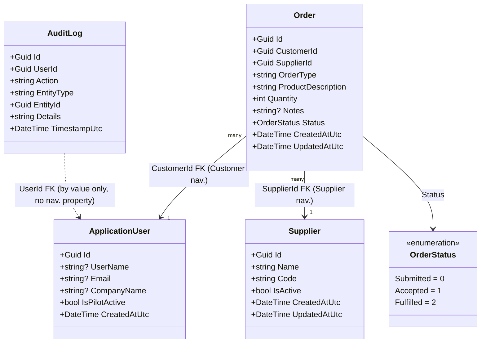
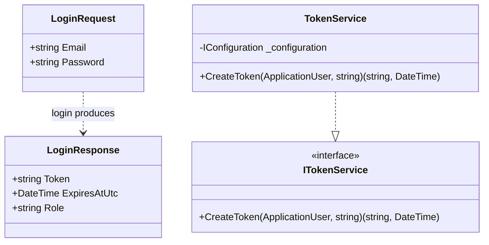
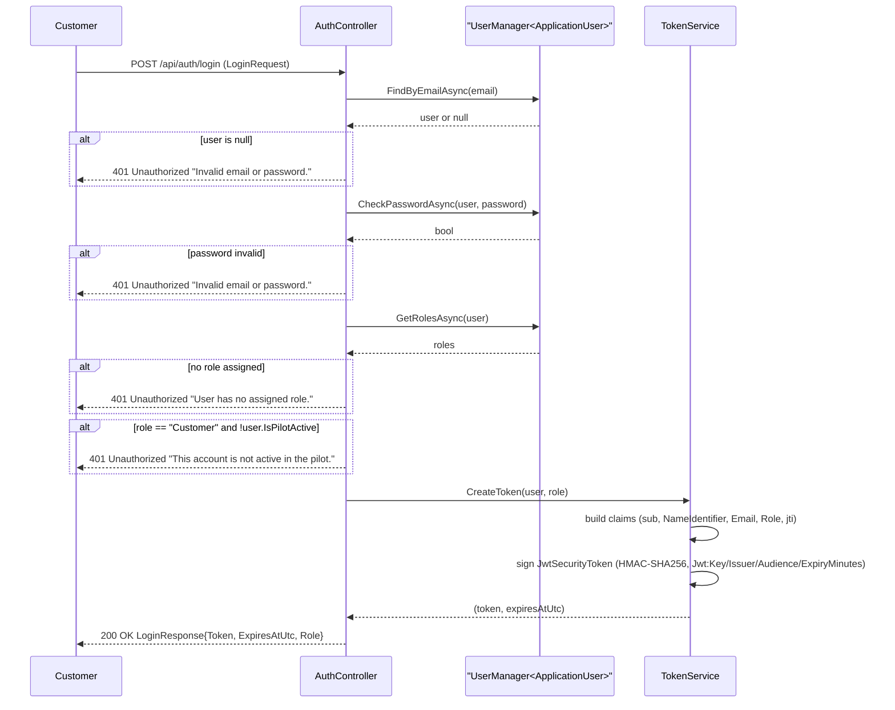
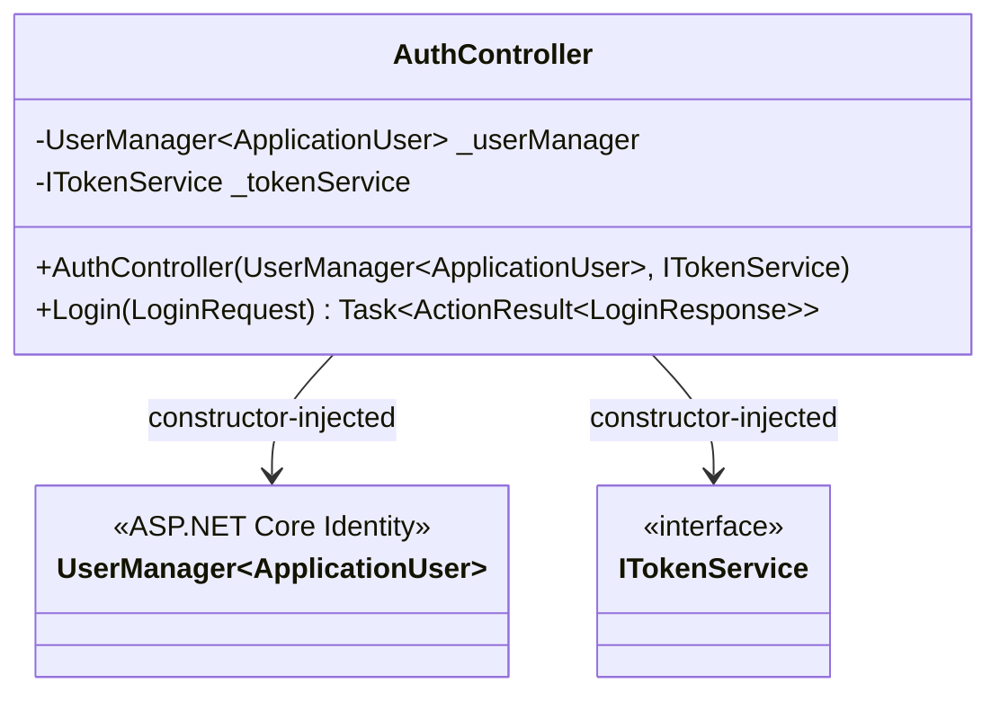
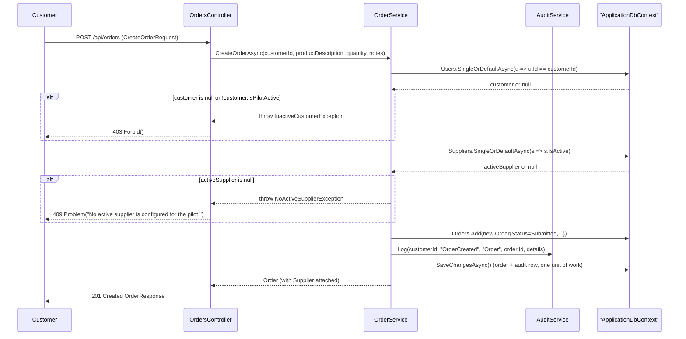
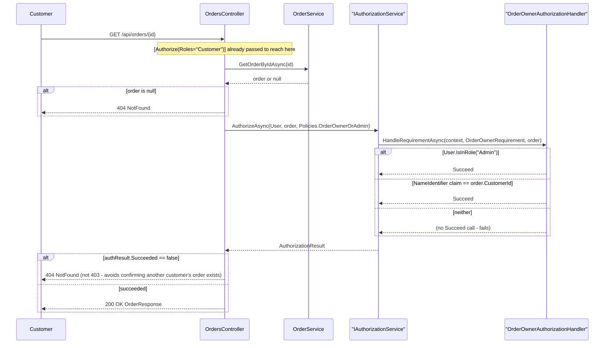
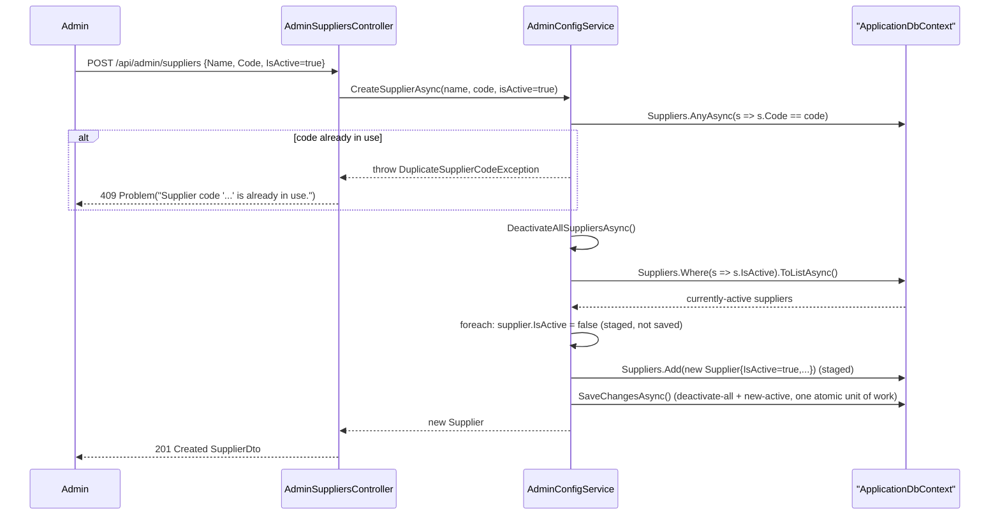
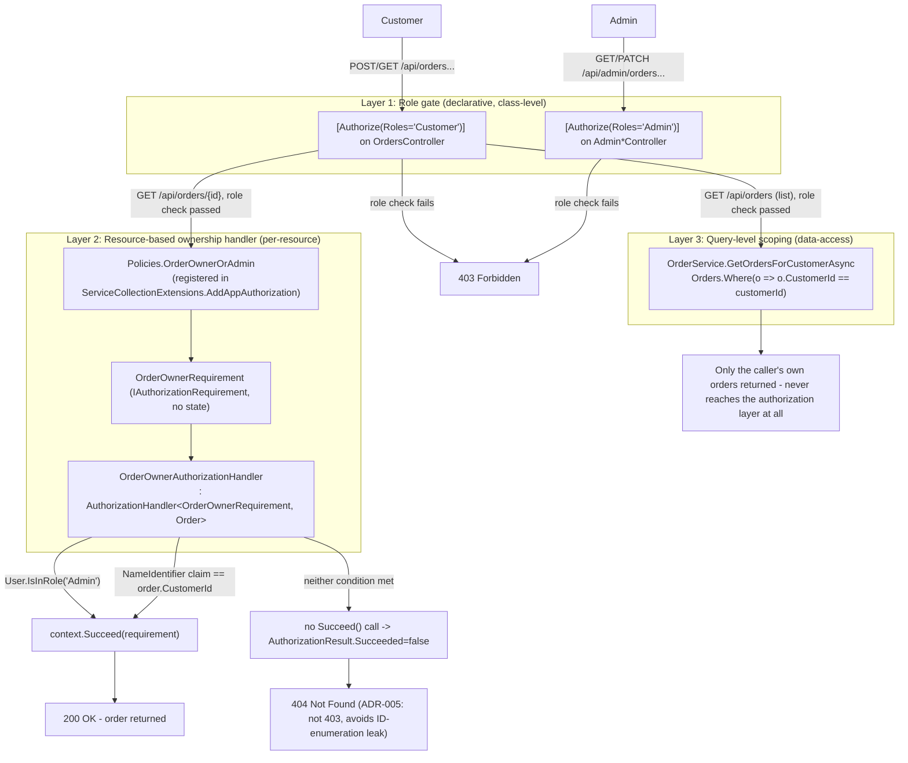

# Architecture Review: order-placement-pilot
Mode: lld

Per-module low-level diagrams for the implemented `order-placement-pilot` feature. Every diagram below is grounded in the real source listed in that module's "Grounded in" line — no module's structure or flow was inferred from its name alone. Module numbering and grouping follow the request; naming and responsibilities are cross-checked against the approved `order-placement-pilot-architecture.md` component table so the two documents describe the same system.

---

## Module 1: Domain/Entities

Grounded in: `src/OrderPilot.Api/Domain/Entities/ApplicationUser.cs`, `src/OrderPilot.Api/Domain/Entities/Supplier.cs`, `src/OrderPilot.Api/Domain/Entities/Order.cs`, `src/OrderPilot.Api/Domain/Entities/OrderStatus.cs`, `src/OrderPilot.Api/Domain/Entities/AuditLog.cs`

All five entities are plain EF Core-mapped POCOs (`ApplicationUser` additionally extends `IdentityUser<Guid>` from ASP.NET Core Identity). `Order.CustomerId` and `Order.SupplierId` are FK scalars with corresponding nullable navigation properties (`Customer`, `Supplier`); `AuditLog.UserId` is FK-by-value only, with no navigation property, per the entity file and the architecture doc's explicit note ("acting user, by ID only, no navigation property"). `OrderStatus` is a strictly-ordinal enum (`Submitted=0 → Accepted=1 → Fulfilled=2`), which `OrderService.UpdateOrderStatusAsync` relies on via integer comparison (see Module 4).



Notes grounded in code, not inferred: `IdentityUser<Guid>` inheritance is why `ApplicationUser` has no explicit `Id`/`Email`/`UserName` declared in `ApplicationUser.cs` (they come from the base class) — the diagram surfaces them anyway since they're load-bearing for Module 2 and 3. `AuditLog`'s relationship to `ApplicationUser` is drawn as a dependency (`..>`), not an association, because the entity genuinely has no navigation property — drawing a solid FK arrow here would misrepresent the code.

---

## Module 2: AuthController + TokenService

Grounded in: `src/OrderPilot.Api/Controllers/AuthController.cs`, `src/OrderPilot.Api/Services/TokenService.cs`, `src/OrderPilot.Api/Services/ITokenService.cs`, `src/OrderPilot.Api/Dtos/Auth/LoginRequest.cs`, `src/OrderPilot.Api/Dtos/Auth/LoginResponse.cs`, `src/OrderPilot.Api/Extensions/ServiceCollectionExtensions.cs` (JWT wiring)

### Class diagram — DTOs

`LoginRequest`/`LoginResponse` are pure data-transfer DTOs with no methods and no logic of their own; the behavior lives in `AuthController.Login` and `TokenService.CreateToken`, both captured in the sequence diagram below. There is no additional class/data-shape diagram to add for this module beyond the DTO shapes and that flow — padding further would just restate the sequence diagram as static structure.



### Sequence diagram — login flow

Traces `AuthController.Login` (`AuthController.cs:22-51`) exactly: email lookup, password check, role lookup, the `IsPilotActive` gate for the `Customer` role only (`AdminConfigService.CustomerRole` constant, not a hardcoded string), then JWT issuance via `TokenService.CreateToken` (`TokenService.cs:19-49`), which reads `Jwt:Key`/`Issuer`/`Audience`/`ExpiryMinutes` from configuration and signs with HMAC-SHA256.



---

## Module: AuthController (scoped re-run — `modules="AuthController"`)

Grounded in: `src/OrderPilot.Api/Controllers/AuthController.cs`

The earlier run bundled this controller with `TokenService` under "Module 2" and diagrammed the DTOs and the login sequence, but never drew `AuthController` itself as a class — its constructor-injected dependencies and its single action were only implied by the sequence diagram. This scoped re-run adds that missing piece rather than repeating Module 2's sequence diagram, which remains accurate and unchanged (`AuthController.cs` has not been modified since).

### Class diagram — AuthController



Both dependencies are constructor-injected per `AuthController.cs:13-20` — `UserManager<ApplicationUser>` comes from ASP.NET Core Identity's DI registration (`AddAppDataAndIdentity` in `ServiceCollectionExtensions.cs`), `ITokenService` from `AddAppServices` in the same file. `AuthController` has exactly one action, `Login` (`AuthController.cs:22-51`), with no other public surface — there is nothing else to add to this class diagram without inventing structure that isn't in the file.

For the request/response flow through these two dependencies, see Module 2's sequence diagram above — it is not redrawn here since scoping to `AuthController` alone doesn't change what actually happens at runtime, only which class's own shape gets drawn explicitly.

---

## Module 3: OrdersController + OrderService

Grounded in: `src/OrderPilot.Api/Controllers/OrdersController.cs`, `src/OrderPilot.Api/Services/OrderService.cs`, `src/OrderPilot.Api/Services/IOrderService.cs` (exception types), `src/OrderPilot.Api/Authorization/OrderOwnerAuthorizationHandler.cs`, `src/OrderPilot.Api/Authorization/Policies.cs`, `src/OrderPilot.Api/Extensions/ClaimsPrincipalExtensions.cs`

### Sequence diagram — order creation (POST /api/orders)

Traces `OrdersController.Create` (`OrdersController.cs:25-41`) into `OrderService.CreateOrderAsync` (`OrderService.cs:18-54`): customer lookup + `IsPilotActive` check → `InactiveCustomerException` → `Forbid()` (403); single active-supplier lookup → `NoActiveSupplierException` → `Problem(409)`; otherwise the order and its audit row are staged on the same `ApplicationDbContext` and committed in one `SaveChangesAsync`.



### Sequence diagram — GetById ownership check (404, not 403)

Traces `OrdersController.GetById` (`OrdersController.cs:50-67`). The class-level `[Authorize(Roles="Customer")]` on `OrdersController` already blocks non-Customer callers before this action runs (role gate — see Module 6). Within the action, a missing order and an order that exists but fails the `OrderOwnerOrAdmin` policy both return `404`, per the explicit code comment at `OrdersController.cs:62` — this is ADR-005 in the approved architecture doc (avoids confirming another customer's order ID exists).



---

## Module 4: Admin/AdminOrdersController + status update

Grounded in: `src/OrderPilot.Api/Controllers/Admin/AdminOrdersController.cs`, `src/OrderPilot.Api/Services/OrderService.cs` (`UpdateOrderStatusAsync`, `OrderService.cs:89-110`), `src/OrderPilot.Api/Services/AuditService.cs`, `src/OrderPilot.Api/Dtos/Admin/UpdateOrderStatusRequest.cs`

Traces `AdminOrdersController.UpdateStatus` (`AdminOrdersController.cs:39-60`): parses the status string, then delegates to `OrderService.UpdateOrderStatusAsync`, which enforces the forward-only transition by comparing the enum's underlying int (`(int)newStatus != (int)order.Status + 1`) and throws `InvalidStatusTransitionException` → HTTP 409 on any non-sequential jump (confirmed by `AdminOrderWorkflowTests.Admin_SkippingStatusTransition_Returns409`, which attempts `Submitted → Fulfilled` directly and asserts `409 Conflict`). The audit row and the status change are staged on the same context and committed together in one `SaveChangesAsync` (confirmed by `AdminOrderWorkflowTests.Admin_UpdatesOrderStatus_ProducesCorrectAuditRow`, which asserts exactly one `OrderStatusChanged` audit row with `"Submitted -> Accepted"` in `Details`).

```mermaid
sequenceDiagram
    participant Admin
    participant AdminOrdersController
    participant OrderService
    participant AuditService
    participant DbContext as "ApplicationDbContext"

    Admin->>AdminOrdersController: PATCH /api/admin/orders/{id}/status (UpdateOrderStatusRequest)
    AdminOrdersController->>AdminOrdersController: Enum.TryParse<OrderStatus>(request.Status)
    alt unparseable status
        AdminOrdersController-->>Admin: 400 BadRequest
    end
    AdminOrdersController->>OrderService: UpdateOrderStatusAsync(id, adminUserId, newStatus)
    OrderService->>DbContext: Orders.SingleOrDefaultAsync(o => o.Id == id)
    DbContext-->>OrderService: order or null
    alt order is null
        OrderService-->>AdminOrdersController: throw KeyNotFoundException
        AdminOrdersController-->>Admin: 404 NotFound
    end
    OrderService->>OrderService: check (int)newStatus == (int)order.Status + 1
    alt not the next sequential status
        OrderService-->>AdminOrdersController: throw InvalidStatusTransitionException
        AdminOrdersController-->>Admin: 409 Problem(ex.Message)
    end
    OrderService->>OrderService: order.Status = newStatus; order.UpdatedAtUtc = now
    OrderService->>AuditService: Log(adminUserId, "OrderStatusChanged", "Order", order.Id, "{prev} -> {new}")
    OrderService->>DbContext: SaveChangesAsync() (status change + audit row, one unit of work)
    OrderService-->>AdminOrdersController: updated Order
    AdminOrdersController-->>Admin: 200 OK AdminOrderResponse
```

---

## Module 5: Admin/AdminSuppliersController + AdminConfigService

Grounded in: `src/OrderPilot.Api/Controllers/Admin/AdminSuppliersController.cs`, `src/OrderPilot.Api/Services/AdminConfigService.cs` (`CreateSupplierAsync`/`UpdateSupplierAsync`/`DeactivateAllSuppliersAsync`, `AdminConfigService.cs:71-144`), `src/OrderPilot.Api/Services/IAdminConfigService.cs`

Traces the single-active-supplier invariant exactly as implemented — this is ADR-006 in the approved architecture doc. `DeactivateAllSuppliersAsync` is a private helper that loads every currently-`IsActive` supplier via the EF Core change tracker and flips each to `false`, staged (not saved) in the same unit of work as the caller's own change. Both `CreateSupplierAsync` (when `isActive=true`) and `UpdateSupplierAsync` (when activating a previously-inactive supplier) call it before their own single `SaveChangesAsync`, so deactivation-of-others and activation-of-the-new-one commit atomically or not at all. Confirmed by `AdminOrderWorkflowTests.Admin_ActivatingSupplier_DeactivatesPreviouslyActiveSupplier` (creates a second `IsActive=true` supplier via `POST /api/admin/suppliers` and asserts the original supplier is now `IsActive=false`).



Note: `AdminSuppliersController.Update` (`PATCH /api/admin/suppliers/{id}`) reaches the same `DeactivateAllSuppliersAsync` path through `AdminConfigService.UpdateSupplierAsync` when `isActive && !supplier.IsActive` — same invariant, same atomicity, different entry point (activating an existing supplier rather than creating a new active one); not diagrammed separately since the sequence is identical from `DeactivateAllSuppliersAsync` onward.

---

## Module 6: Authorization (OrderOwnerRequirement + OrderOwnerAuthorizationHandler) — ADR-004

Grounded in: `src/OrderPilot.Api/Authorization/OrderOwnerRequirement.cs`, `src/OrderPilot.Api/Authorization/OrderOwnerAuthorizationHandler.cs`, `src/OrderPilot.Api/Authorization/Policies.cs`, `src/OrderPilot.Api/Extensions/ServiceCollectionExtensions.cs` (`AddAppAuthorization`, registers the handler + policy), `src/OrderPilot.Api/Controllers/OrdersController.cs` (class-level `[Authorize(Roles="Customer")]`), `src/OrderPilot.Api/Controllers/Admin/AdminOrdersController.cs` (class-level `[Authorize(Roles="Admin")]`), `src/OrderPilot.Api/Services/OrderService.cs` (`GetOrdersForCustomerAsync`, `OrderService.cs:56-63`)

This maps directly to **ADR-004** in the approved architecture doc: "Customer-scoped, Admin-separated authorization via role gate + resource-based ownership policy + query-level scoping." All three layers are independently enforced in code, not just described — no single layer alone would close the gap ADR-004 identifies (a role-only gate can't stop customer-vs-customer leakage on a single-resource lookup; a client-supplied filter could be omitted or altered by a malicious customer).

- **Layer 1 — Role gate**: `[Authorize(Roles="Customer")]` on `OrdersController`, `[Authorize(Roles="Admin")]` on every `Admin*Controller`. Verified by `RoleGatingTests` (`Customer_HittingAdminRoute_Returns403`, `Admin_HittingCustomerOrdersRoute_Returns403`, `AnonymousRequest_ToProtectedRoute_Returns401`).
- **Layer 2 — Resource-based ownership handler**: `Policies.OrderOwnerOrAdmin`, backed by `OrderOwnerAuthorizationHandler`, evaluated on `GET /api/orders/{id}` (see Module 3's second sequence diagram). Verified by `OrderOwnerAuthorizationHandlerTests` (`Admin_AlwaysSucceeds_RegardlessOfOrderOwner`, `MatchingCustomer_Succeeds`, `DifferentCustomer_DoesNotSucceed`) and, at the HTTP level, `OrderIsolationTests.CustomerB_CannotGetCustomerA_OrderById` / `CustomerA_CanGetOwnOrder` / `Admin_CanGetAnyCustomer_OrderById`.
- **Layer 3 — Query-level scoping**: `OrderService.GetOrdersForCustomerAsync` filters `Orders.Where(o => o.CustomerId == customerId)` at the database query itself, so `GET /api/orders` (list) can never leak another customer's row regardless of what the authorization layer decides. Verified by `OrderIsolationTests.CustomerB_OrderList_NeverIncludesCustomerA_Order`.



This diagram deliberately traces to ADR-004's own wording ("three layers, applied together rather than any single one alone") rather than only listing the classes — the point of the ADR is that removing any one layer reopens a specific gap, and the flowchart shows which gap each layer closes.
