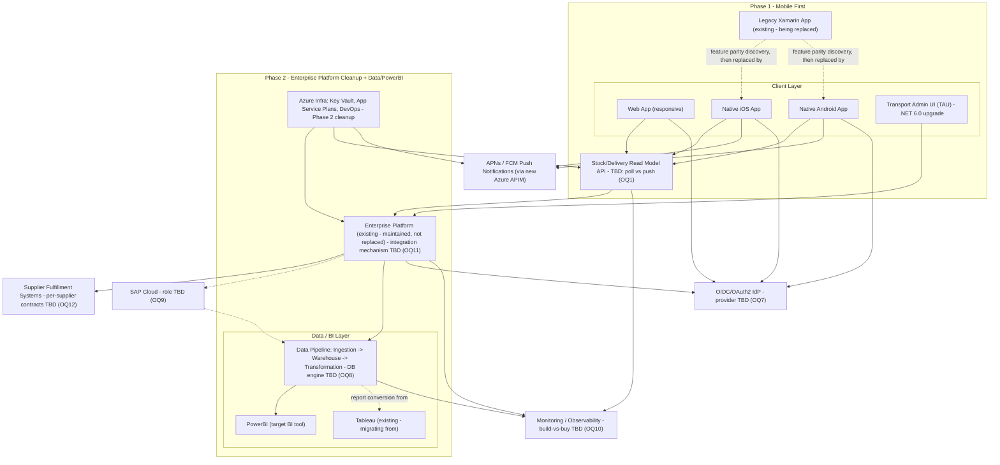

# Architecture Review: supply-chain-solutions-for-logistics
Mode: design

> **This is a first-pass, pre-implementation review of the full parent PRD**, distinct from `order-placement-pilot-architecture.md` (APPROVED), which covers only a deliberately narrowed FR-002 slice built by a 4-person team. Nothing in that pilot's approval carries over here: the pilot's ADRs (auth = username/password, no supplier integration, polling) were explicitly scoped decisions for a 4-week slice, not decisions made on this PRD's behalf. This review treats the full 8-FR scope on its own terms.

## Approval Status: NEEDS_DECISIONS

No implementation exists for this PRD (confirmed greenfield: no `src/`, no dependency manifest, no application code — per the enrichment report's codebase scan). The `/PRDFeasibility` verdict was **REJECT** for the stated team (2 BE, 1 FE, 1 QA) and 4-week timeline, and the validation and enrichment reports both list six architecture-relevant Product Owner decisions as explicitly unresolved. Six of the open items below are HIGH severity per this agent's own severity rubric (ambiguous decisions with materially different architectural outcomes depending on the answer) and one — input validation/session management — is a genuine specification gap, not a drafted-but-pending item. Per the constraint "never approve a design with an unresolved HIGH or Critical severity item," this cannot be marked `APPROVED`. It is also not `REJECTED`: nothing here is technically infeasible, and every blocked area below has at least one viable design path once its blocking decision lands — there is no acceptance criterion this design is structurally unable to satisfy. `NEEDS_DECISIONS` is the accurate, non-forced outcome.

## High-Level Design (HLD)

Standalone system-level HLD refresh (`architecture-review.generateHLD`), regenerated from the design and ADRs above plus the enrichment/feasibility dependency maps — no new design decisions are made here, only the diagram. It groups components into the PRD's own two build phases (Phase 1: mobile-first; Phase 2: Enterprise Platform cleanup + Data/PowerBI) and shows every client, platform, data/BI, monitoring, and external-system box named in the architecture design, the enrichment report's dependency map, and the feasibility report's 10-item integration touchpoints table. Seven boxes are labeled `TBD` because their internals are blocked by one of the 14 open questions above and this review does not guess at them: the **Stock/Delivery Read Model**'s transport (poll vs. push — OQ1), the **Enterprise Platform**'s integration mechanism (OQ11), the **Data Pipeline**'s storage engine (OQ8), **SAP Cloud**'s role (OQ9), the **Monitoring/Observability** build-vs-buy call (OQ10), the **OIDC/OAuth2 IdP**'s actual provider (OQ7), and the **Supplier Fulfillment Systems**' per-supplier contracts (OQ12).

## Architecture Design

Presented per functional requirement. Each entry states what can be designed today from the PRD as written, and what is explicitly blocked pending a named decision — not guessed.

### FR-001 — Web/mobile stock & delivery visibility

**Designable now:** A logical **Stock/Delivery Read Model** component sits between clients (responsive web app, native iOS app, native Android app) and the system(s) of record for inventory/delivery state. Clients consume this read model through a single API contract shared across web and mobile, rather than three independent integrations, so that "reflecting backend state within [target latency]" (the AC as written) is enforced once, not per-client.

**Blocked:**
- Whether the read model is served by polling a REST endpoint on an interval or requires push/streaming (SignalR/WebSockets/Azure Event Grid) is an architectural fork, not an implementation detail — it depends entirely on the still-undefined "[target latency — TBD]" in FR-001's own acceptance criterion. A polling design and a streaming design have different infrastructure, cost, and failure-mode profiles; committing to either now would be guessing at a business decision (how "real-time" does the business actually need this).
- Whether this read model is genuinely new or a facade over the existing (out-of-repo, un-inspected) Enterprise Platform's own data cannot be determined without the Enterprise Platform discovery spike the feasibility report calls a hard prerequisite.
- Native mobile client architecture (shared business-logic layer across iOS/Android, or fully independent codebases) cannot be designed without the Xamarin feature-parity discovery spike — the current native rewrite scope is, by the enrichment's own words, "undiscovered."

### FR-002 — Enterprise Platform order placement

**Designable now:** A logical **Order domain** (Order, Supplier entities; an OrderService boundary responsible for create/submit/track) is a defensible decomposition regardless of downstream decisions — every viable implementation of FR-002 needs some version of this boundary. `order-placement-pilot-architecture.md` already validates this shape works for a narrow slice; this PRD's FR-002 is the same domain at full scope ("one or more Suppliers," full audit NFR, full SSO).

**Blocked:**
- The PRD frames this as "maintain" the Enterprise Platform, implying an existing order-placement flow being extended — but that platform's source is outside this repository and was unavailable for analysis. Any concrete integration point (does this repo call into the Enterprise Platform's API, share its database, or replace a module of it) is unverified.
- Supplier-side fulfillment integration contracts (protocol, auth, idempotency/retry) for "one or more Suppliers" are not described anywhere in the PRD and are supplier-specific, not something this review can assume.
- SAP Cloud appears in the suggested stack with no stated role. If SAP Cloud is the actual supplier-facing ERP/fulfillment system behind "Suppliers," that materially changes this domain's external integration boundary. This review will not guess SAP Cloud's role.

### FR-003 / FR-005 — Data collection, analysis, and demand/supply insights

**Designable now:** A generic **Ingestion → Storage/Warehouse → Transformation → BI Exposure** pipeline shape is a reasonable default for "collect and analyze data... expose it to at least one reporting/BI tool," and PowerBI is already confirmed as the target BI layer.

**Blocked:**
- SAP Cloud's role (see FR-002) is doubly relevant here — the suggested stack lists it alongside NodeJS/PostgreSQL/Python/Data Engineering with no explanation; it may be a source system this pipeline needs to ingest from, in which case its data model and access pattern are an unknown that shapes the ingestion layer's design.
- The database/warehouse engine (SQL Server vs. PostgreSQL — both appear in the suggested stack) is undecided and materially affects the storage-layer design and tooling choice (e.g., native PowerBI connectors differ by engine).
- Refresh cadence, and which "relevant internal role" FR-005's insight report/dashboard targets, are both unspecified beyond the draft acceptance criteria's placeholders.
- The Tableau→PowerBI conversion's actual scope (report count, DAX/calculated-field complexity) is unbounded — no inventory exists to size against.

### FR-004 — Real-time inventory/order automation

**Designable now:** Same Read Model boundary as FR-001; this requirement is the write/propagation-side counterpart of the same architectural question, not a separate one.

**Blocked:** Identical blocker to FR-001 — the "[target latency — TBD]" threshold is the fork between a polling-based design and a push/streaming design. Designing this before that number exists risks either under-building (missing an SLA nobody stated yet) or over-building (streaming infrastructure nobody asked for).

### FR-006 — Near-real-time production monitoring

**Designable now:** A logical separation between **application telemetry, infrastructure telemetry, and business-event alerting** is a reasonable category breakdown regardless of tooling.

**Blocked:**
- Build-vs-buy (Azure Monitor/Application Insights vs. a bespoke monitoring tool) is explicitly undecided — the PRD's own wording ("implement... a monitoring tool") leans build, while "Key Outcomes Expected" says to first "understand the existing monitoring setup," implying reuse may be intended instead. These lead to materially different components (a subscription/configuration exercise vs. a service this team owns and operates).
- "[target latency — TBD]" for alert delivery is the third undefined threshold blocking a concrete design (does an alert need to fire in seconds, requiring an event-driven pipeline, or is a minutes-level polling check sufficient).
- What the "existing monitoring setup" in the legacy Enterprise Platform actually is (referenced in Key Outcomes) is not accessible from this repository.

### FR-007 — Agile project management with data-driven delivery

**Fully designable now** — see ADR-007. No blocking decision; this is a process/tooling adoption, not a system component with unresolved integration or data-model questions.

### FR-008 — Azure DevOps wiki / knowledge repository

**Fully designable now** — see ADR-006. No blocking decision.

---

**What this design deliberately does not do:** commit to a database engine, an identity provider, a monitoring vendor, a real-time transport mechanism, or a SAP Cloud integration contract. Each of those is a named open question below, not an assumption embedded silently in a component diagram.

## ADRs

Only decisions that are genuinely decidable now, without guessing at a business, security, or integration choice that belongs to the PO or a discovery spike.

1. **ADR-001: No existing implementation to conform to — every foundational choice is a first-time decision**
   - Context: The enrichment report confirms this repository is greenfield (no `src/`, no dependency manifest, no application code, no test suite). This inverts the normal pre-implementation review posture: there is no prior pattern to check new components against.
   - Decision: This review — and any future one for this PRD until code exists — treats every architectural choice as a first-time decision, not an extension. No design element below is justified by "matches existing code," because none exists.
   - Alternatives considered: N/A — this is a factual statement about starting conditions, not a choice between options. Recorded per this agent's own instruction to document even a "nothing to reuse" finding, since it materially changes how every other ADR and open question should be read.
   - Consequences: Every one of the ADRs below carries more risk than the equivalent decision would in a codebase with existing patterns, because there is no working precedent in this repo to validate against before code is written.

2. **ADR-002: Domain-aligned service decomposition, not a single monolith**
   - Context: The eight FRs span native mobile (Swift/Kotlin or equivalent), a web/ordering platform (suggested ASP.NET/.NET or Node), a data/analytics pipeline (suggested Python/Data Engineering), and a monitoring capability that may be a third-party product rather than code this team owns at all. The feasibility report independently concludes the full scope needs ~10-14 people across distinct specialist roles (native mobile, data engineer, DevOps/SRE, security) sustained over 2-3 quarters — i.e., multiple concurrently-active, differently-skilled workstreams, not one team iterating on one codebase.
   - Decision: Decompose along domain boundaries into independently deployable units — a Mobile Client tier (native iOS/Android, out of process from the backend entirely), an Ordering/Platform service, a Data/Analytics pipeline, and a Monitoring/Observability capability (build or integrate, per ADR pending open question) — rather than a single backend monolith serving all of FR-001–FR-006.
   - Alternatives considered: A single layered monolith covering ordering, read-model, and data-pipeline logic — rejected not on a stylistic microservices-vs-monolith preference, but because the domains genuinely require different runtimes (native mobile code cannot live inside a backend monolith at all; a Python-based data-engineering pipeline is a different runtime from a suggested .NET/Node backend). This is a decomposition forced by the stack's own technology breadth, not an assumption about team size or scale.
   - Consequences: Each domain can be staffed, versioned, and deployed independently, matching the feasibility report's multi-specialist staffing model. Cost: cross-domain contracts (e.g., what the Data pipeline reads from the Ordering service) must be explicit APIs/events rather than in-process calls — this is additional integration design work that a monolith would avoid, accepted here because the alternative isn't actually available given the stack breadth.

3. **ADR-003: Discovery-spike-first policy for legacy-dependent components**
   - Context: FR-002 (Enterprise Platform) and the Phase 1 mobile rewrite both depend on systems whose source is outside this repository and was unavailable for analysis. The feasibility report independently identifies a discovery spike against both as a hard prerequisite, not an optional nice-to-have.
   - Decision: No design or build commitment for the Enterprise Platform integration boundary or the native mobile feature-parity surface proceeds past this logical-component level (ADR-002's domain boxes) until a discovery spike has directly inspected the actual legacy source and produced a concrete integration contract / feature inventory.
   - Alternatives considered: Proceeding with an assumed integration contract (e.g., "the Enterprise Platform exposes a REST API we can call") — rejected because this is exactly the kind of invented integration decision this review is constrained not to make, and because the feasibility report already prices the cost of getting this wrong as materially higher than the cost of a short discovery spike.
   - Consequences: FR-002 and the mobile rewrite cannot move to detailed design until the spike completes; this is a real sequencing cost but converts an unverified assumption into an evidence-based design decision.

4. **ADR-004: Audit logging pattern — append-only log with old/new value capture, written transactionally with the triggering operation**
   - Context: Unlike the [DRAFT] items, the Security NFR is stated in the PRD as a firm requirement, not a draft: "Every data operation is audited, storing old & new values along with user ID and datetime of the operation." This is concrete enough to design against now, and a working precedent for the pattern already exists in this program (`order-placement-pilot`'s `AuditService`/`AuditLog`, conformance-verified).
   - Decision: An append-only audit entity (actor/user ID, entity type + ID, action, old value, new value, timestamp) is written inside the same unit of work as the mutating operation it records, for every data-mutating operation across every service in ADR-002's decomposition — not as an out-of-band pipeline that could silently fall behind or drop events.
   - Alternatives considered: An asynchronous/out-of-band audit pipeline (e.g., event-stream-based) — rejected for this NFR specifically because "storing old & new values" implies a need for guaranteed capture at the moment of mutation, and an async path introduces a window where the audit record could be lost if the pipeline fails, which a synchronous in-transaction write does not.
   - Consequences: Slight write-latency cost on every mutating operation (bounded, well-understood cost); in exchange, no operation can complete without its audit record also being durably written. This pattern is technology-agnostic and does not require the DB-engine decision (SQL Server vs. PostgreSQL) to be resolved first.

5. **ADR-005: Authorization enforcement pattern — role gate + resource-level ownership + query-level scoping, independent of IdP choice**
   - Context: The PRD states a firm requirement ("All requests accessing secured content are authorized based on assigned roles & permissions") separate from the still-open IdP choice (SSO via OIDC/OAuth2, likely but unconfirmed Azure AD/Entra ID). The *enforcement pattern* and the *identity provider that issues the claims it checks* are separable decisions.
   - Decision: Adopt a layered enforcement pattern — declarative role/claims gating at the controller/endpoint boundary, a resource-based ownership check for any endpoint returning a specific record a caller might not own (e.g., a business customer's own order), and query-level scoping so list endpoints cannot leak another party's rows regardless of what the authorization layer decides. This mirrors the pattern already built and conformance-verified in `order-placement-pilot` (ADR-004/ADR-005 there), generalized across this PRD's four personas (Business Customer, Supplier, Internal Admin, Developer/Support).
   - Alternatives considered: A single flat role check with no resource-level ownership verification — rejected for the same reason it was rejected in the pilot: a role-only gate cannot prevent one Business Customer from viewing another's orders on a single-resource lookup.
   - Consequences: This pattern is stable regardless of which IdP is eventually chosen (ADR depends only on "claims/roles exist," not on who issues them), so it can be built once the IdP decision lands without being redesigned. It does not by itself resolve the IdP choice, session/token lifecycle across three client surfaces (web + 2 native apps), or the deferred input-validation/session-management requirements — those remain open questions below.

6. **ADR-006: Documentation is part of the Definition of Done, not a separate backlog item (FR-008)**
   - Context: FR-008 requires an Azure DevOps wiki page per shipped feature. This repository's own Claude Workflow scaffolding already encodes a Definition-of-Done template pattern (referenced in the enrichment report) that can be mirrored rather than invented.
   - Decision: A wiki page (purpose, architecture, operational runbook) is a Definition-of-Done gate for any feature across any of the domains in ADR-002 — a feature is not "done" without it, rather than documentation being tracked as separate, deprioritizable backlog work.
   - Alternatives considered: Documentation as a separate, lower-priority backlog item — rejected because that is the standard failure mode this requirement exists to prevent (docs perpetually deferred), and because a DoD gate costs nothing to state now.
   - Consequences: Slightly slows "done" on paper (a page must exist before close-out); in exchange, avoids the documentation-debt outcome FR-008 is explicitly trying to prevent.

7. **ADR-007: Agile delivery cadence with visible backlog and delivery metrics (FR-007)**
   - Context: FR-007 requires "an Agile approach for project management with data-driven delivery," without specifying a tool. No PO decision is needed to adopt a standard sprint/iteration cadence — this is a process choice within engineering's normal discretion, not a business or security decision.
   - Decision: Sprint/iteration-based delivery, backlog and velocity/delivery metrics tracked and visible in the team's project management tool (Linear, per this repo's existing Claude Workflow tooling, or Azure DevOps Boards if that is the team's eventual choice).
   - Alternatives considered: Ad hoc/Kanban-only flow with no metrics tracking — rejected because FR-007 explicitly asks for "data-driven delivery," which requires some tracked metric, not just an iterative process.
   - Consequences: Requires whichever team eventually staffs this PRD to adopt sprint discipline from day one; low cost, directly satisfies the stated requirement.

## Requirement Traceability

| Requirement ID | Design Element | Status |
|---|---|---|
| FR-001 | Stock/Delivery Read Model boundary (ADR-002) serving web + native mobile via one shared contract | Partial — component boundary is designable; concrete transport (poll vs. push) blocked on 3 undefined latency thresholds; mobile client architecture blocked on Xamarin discovery spike (ADR-003) |
| FR-002 | Order/Supplier domain boundary (ADR-002), consistent with `order-placement-pilot`'s validated shape at full scope | Partial — domain boundary is designable; concrete Enterprise Platform integration and supplier fulfillment contracts blocked on discovery spike (ADR-003) and supplier-specific contracts not in the PRD |
| FR-003 | Ingestion → Warehouse → Transformation → BI Exposure pipeline (ADR-002), PowerBI confirmed as exposure layer | Partial — pipeline shape is designable; ingestion sources blocked on SAP Cloud's undefined role; storage layer blocked on DB/warehouse engine choice; refresh cadence unspecified |
| FR-004 | Same Read Model boundary as FR-001 (write/propagation side) | Partial — identical blocker to FR-001 (latency thresholds gate poll-vs-push architecture) |
| FR-005 | Same pipeline as FR-003, dashboard exposure to an internal role | Partial — same blockers as FR-003, plus target role/schedule unspecified beyond draft placeholder |
| FR-006 | Monitoring/Observability capability (ADR-002); telemetry categories (app/infra/business-event) identified | Unsatisfied (blocked) — build-vs-buy undecided, alert-latency threshold undefined, legacy monitoring setup (referenced in Key Outcomes) inaccessible for reuse assessment |
| FR-007 | Sprint/iteration cadence + backlog/delivery metrics in project management tool (ADR-007) | Satisfied — fully designable now, no blocking decision |
| FR-008 | Per-feature Azure DevOps wiki page as a Definition-of-Done gate (ADR-006) | Satisfied — fully designable now, no blocking decision |

**6 of 8 FRs are partial-or-blocked; 2 of 8 (process/documentation requirements) are fully designable today.** This is consistent with the enrichment report's own framing: the technical, data-bearing requirements are exactly the ones gated by the six open PO items, while the process requirements were never blocked by them.

## Risks

- **HIGH** — Data-layer architecture for FR-001/FR-004 cannot be committed while the 3 latency thresholds remain undefined. Building a polling design and later discovering push/streaming was actually required (or vice versa) means rebuilding the core read path used by every client. (Carried forward from enrichment/validation; independently confirmed by attempting the design above.)
- **HIGH** — Compliance scope (PCI-DSS, food-traceability) is unresolved. If either applies, it changes the *data model itself* (cardholder-data segmentation, lot/batch chain-of-custody fields), not just an add-on control — this is a design-shape risk, not only an effort risk, which is why it stays HIGH at the architecture layer specifically.
- **HIGH** — Input validation and session-management requirements are not specified at all (a genuine gap, not a drafted-but-pending item, per the validation report). This blocks a concrete session/token design across three client surfaces (web + 2 native apps) — a materially larger blast radius than the single-app pilot that already resolved an analogous question for its own narrow scope.
- **HIGH** — Legacy integration contracts (Enterprise Platform, Xamarin app, and potentially SAP Cloud if it turns out to be a supplier-facing system) are unknown. FR-002's and FR-001/FR-004's designs above are provisional at the domain-boundary level only; any deeper design would be an invented integration contract.
- **HIGH** — IdP/SSO architecture is unconfirmed (Azure AD/Entra ID is likely, not decided). Session lifecycle and token propagation across web + 2 native apps must be designed once, consistently, across all three surfaces — an interim guess here risks rework in three codebases simultaneously rather than one.
- **MEDIUM** — Database/warehouse engine (SQL Server vs. PostgreSQL) is undecided. Bounded rework risk (schema/ORM choice), lower blast radius than the items above since it does not reshape the domain model itself.
- **MEDIUM** — Monitoring build-vs-buy (FR-006) is undecided; the PRD's own wording points in different directions ("implement... a tool" vs. "understand the existing... setup").
- **MEDIUM** — SAP Cloud's role is entirely unexplained in the source PRD. If it turns out to be the actual ERP/supplier-integration surface behind FR-002 and/or FR-003's data sources, its late discovery could reshape both domains' external boundaries after they've already been built against an assumed shape.
- **MEDIUM** — Tableau→PowerBI conversion scope (FR-003/FR-005) is unbounded — no report inventory exists to size the BI-exposure component against.
- **LOW** — Concurrent Phase 1/Phase 2 Azure infrastructure changes on shared resources create coordination risk, but this is a scheduling/process risk, not a design-shape risk — already named in the feasibility report and does not require this review to resolve.

No new Critical-severity item was found beyond what enrichment/feasibility already flagged; the count of HIGH items (5) is what keeps this at `NEEDS_DECISIONS` rather than any weaker designation.

## Open Questions for PO/Tech Lead

**Carried forward from the feasibility report's six PO sign-off items — confirmed still binding on the architecture, not merely on the estimate:**

1. What are the actual numeric latency thresholds for FR-001, FR-004, and FR-006 (and the proposed p95 < 500ms API target)? **Binding on:** the poll-vs-push architecture for the data layer and the alerting pipeline shape for monitoring — this is the single largest architecture fork in the whole design.
2. Do PCI-DSS (payment processing) or food-safety/traceability regulations apply, beyond confirmed GDPR? **Binding on:** the data model itself (cardholder-data segmentation, lot/batch traceability fields), not only the security-effort estimate.
3. Should input validation and session-management requirements be defined now, or is deferral genuinely acceptable? **Binding on:** the concrete session/token design across web + 2 native mobile clients — this needs an answer before, not during, IdP integration work.
4. Do you confirm "mobile first, Enterprise Platform/Data as Phase 2" as the intended sequencing? **Binding on:** which domain (ADR-002) gets a discovery spike and detailed design first — this determines critical-path ordering across the program, not just a scheduling preference.
5. Persona priority (Business Customers primary) and the assumed pain points — **lower architecture relevance than items 1-4**: affects which client experience gets designed/prioritized first, but does not change any component boundary or data model shape above. Retained for completeness, not treated as architecture-blocking.
6. Baseline metrics for the Problem Statement — **not architecture-blocking**: relevant to measuring success post-launch, not to any design decision in this document. Retained for completeness only.

**New, architecture-specific questions that surfaced only from attempting the design above (not visible from the estimation-level feasibility pass):**

7. **IdP confirmation:** Is Azure AD/Microsoft Entra ID the actual chosen identity provider, or is another OIDC provider in play? The suggested stack implies Azure AD but never states it. This blocks concrete SSO/session design (ADR-005 only covers the *enforcement pattern*, not the IdP integration itself).
8. **Database engine:** SQL Server or PostgreSQL — both appear in the suggested stack with no indication of which applies to which domain (e.g., is the Ordering/Platform domain SQL Server while the Data/Analytics pipeline is PostgreSQL, or is one engine used throughout?). Blocks schema and ORM-layer design for every domain in ADR-002.
9. **SAP Cloud's actual role:** Is it a source system for the FR-003/FR-005 data pipeline, the actual system behind "Suppliers" in FR-002, an ERP the Enterprise Platform already integrates with, or unrelated to this program's build? The PRD lists it in the suggested stack and never explains it anywhere in the body. This is the single most concrete "don't guess" item in this review — no design decision above assumes an answer.
10. **Monitoring build-vs-buy:** Does "implement... a near real-time monitoring tool" mean build a bespoke service, or configure/extend Azure Monitor/Application Insights? These are different components with different owners (a team-operated service vs. a managed-service configuration).
11. **Enterprise Platform integration mechanism:** Once the discovery spike (ADR-003) happens, will FR-002/FR-001/FR-004 integrate via an API the Enterprise Platform already exposes, a shared database, or something else? This determines whether the new Read Model (FR-001) can be a thin facade or needs to be a genuine system of record in its own right.
12. **Supplier fulfillment contracts:** For FR-002's "one or more Suppliers," what protocol/auth/idempotency behavior does each actual supplier integration require? Each supplier may need a different adapter — this is not resolvable generically.
13. **Tableau report inventory:** How many existing Tableau reports/dashboards need conversion, and at what calculated-field/DAX complexity? Sizes the BI-exposure component in ADR-002's data pipeline.
14. **Stack commitment beyond "directional":** The PRD explicitly frames its suggested stack as "or an alternate stack based on team experience." Given how many ADRs above (IdP, DB engine, monitoring) hinge on an Azure-centric assumption, should the stack be formally committed before further design proceeds, rather than left directional across a program this large?

## Recommendation

**Approval Status: NEEDS_DECISIONS.** This is not a failure of the review — it is the correct outcome given that no implementation exists, the feasibility verdict was REJECT for the only team currently available, and six PO decisions remain open with five of them rated HIGH severity against the architecture specifically (not just the estimate). Forcing an APPROVED status here would mean inventing at least one of: a latency threshold, a compliance scope, an IdP choice, a database engine, SAP Cloud's role, or a legacy integration contract — each of which this agent is constrained not to guess.

**What would need to happen before this could move to `APPROVED`:**
1. PO resolves the six sign-off items from the feasibility/validation reports — particularly the three latency thresholds and the compliance scope, since those two alone reshape the data-layer and data-model architecture, not just the schedule.
2. Explicit architecture decisions land for the four genuinely open technical forks this review surfaced: IdP choice, database engine, monitoring build-vs-buy, and SAP Cloud's role.
3. The discovery spike against the out-of-repo Enterprise Platform and Xamarin app sources runs, producing an actual integration contract and feature-parity inventory (ADR-003) rather than an assumed one.
4. A Tableau report inventory is produced to bound the FR-003/FR-005 BI-conversion component.
5. The staffing gap identified by the feasibility report (2 BE/1 FE/1 QA vs. ~10-14 people across mobile/data/DevOps/security specialties) is closed, or the scope is re-narrowed the way `order-placement-pilot` narrowed FR-002 — since an architecture approved for a team that doesn't exist yet is not actionable regardless of its technical merit.

Once items 1-4 land, re-run `/ArchitectureReview prd="supply-chain-solutions-for-logistics"` with the resolved decisions supplied via the `decisions=` argument — at that point this review can score the remaining design work (which is now unblocked at the domain-boundary level, per the Architecture Design section above) against concrete choices instead of open questions. Item 5 (staffing) does not block re-running this review, but does block moving from an approved design to `/ImplementFeature` at this PRD's full scope, consistent with the sequence report's framing of the parent PRD as gated on staffing independent of the decisions track.
