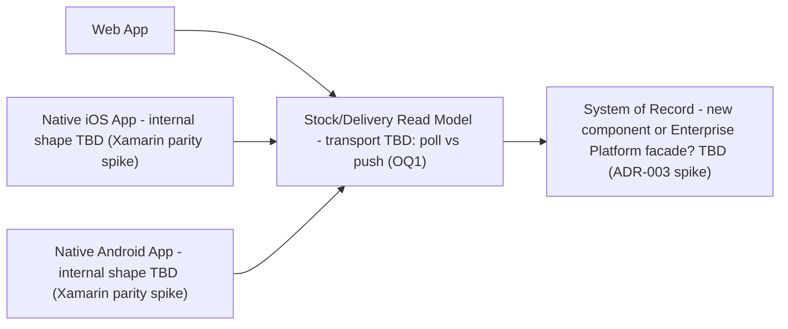
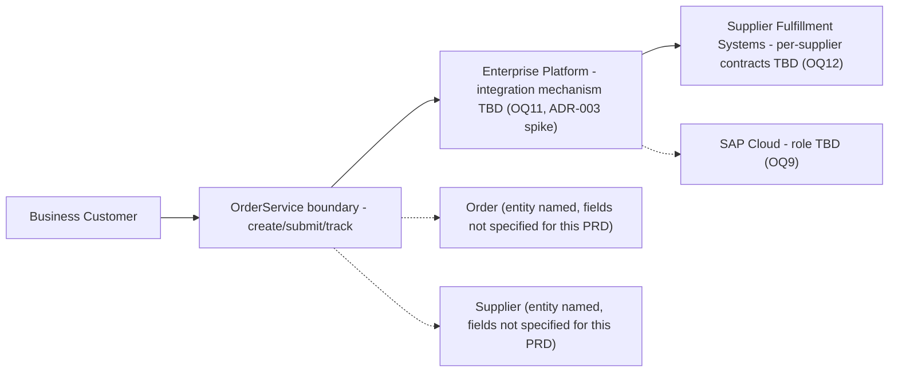
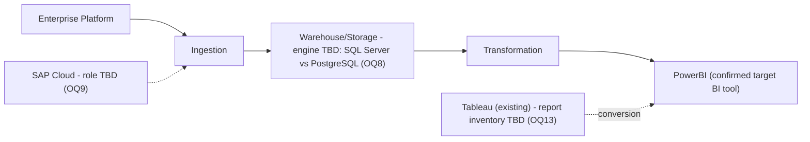
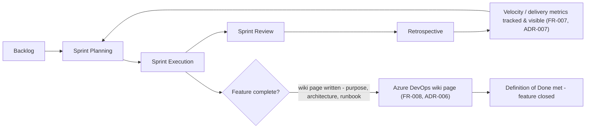

# Architecture Review: supply-chain-solutions-for-logistics
Mode: lld

Per the `architecture-review.generateLLD` task contract: "If no source exists and no design description covers the module, skip it — do not invent structure." This PRD is confirmed greenfield (no `src/`, no manifest, no application code — see the enrichment report's codebase scan) and its architecture review is `NEEDS_DECISIONS` with 14 open questions, most of which block module *internals* specifically. Three modules below have a genuinely described **domain boundary** (from ADR-002 of the architecture doc) even though their internals are blocked — those get a schematic, boundary-only diagram, explicitly not a code-shaped `classDiagram`/`sequenceDiagram`, since drawing either would fabricate fields and flows the architecture review itself refused to guess at. Everything else is skipped, with a reason.

This is, correctly, mostly a skipped document. Compare `order-placement-pilot-lld.md` (six diagrams, all grounded in real source at `src/OrderPilot.Api`) — that PRD is implemented; this one is not. Producing comparable detail here would mean inventing the exact things the architecture review named as unresolved (latency thresholds, DB engine, IdP, SAP Cloud's role, Enterprise Platform integration mechanism, supplier contracts).

---

## Module 1: Stock/Delivery Read Model & Client Boundary (FR-001, FR-004)

**Status: proposed, pre-implementation, boundary-only — internals blocked pending OQ1 (latency thresholds), and pending the ADR-003 discovery spikes against the Enterprise Platform and the legacy Xamarin app.**

The architecture doc treats FR-001 and FR-004 as the read-side and write/propagation-side of the same boundary, not two separate components, so they're diagrammed together. What's actually designable is limited to: (a) that clients share one API contract rather than three independent integrations, and (b) that a logical Read Model sits between clients and whatever system of record backs it. That's the entire boundary that can be drawn honestly.

What's blocked, and why no more can be shown: the transport (poll vs. push/streaming) forks the whole shape of this component and depends on a still-undefined latency threshold (OQ1); whether the Read Model is a new system of record or a facade over the existing Enterprise Platform depends on a discovery spike (ADR-003) against source this repo cannot see; and the native mobile client's internal architecture (shared business-logic layer vs. independent iOS/Android codebases) depends on the Xamarin feature-parity discovery spike (ADR-003), also not yet run. None of those can be drawn as classes or a sequence without inventing an answer to one of the three.

No `classDiagram` (no entity fields are described anywhere in the PRD or architecture doc for this boundary — "inventory/order/delivery state" is named, not shaped) and no `sequenceDiagram` (the request/response pattern itself is exactly what's undecided between polling and push) are produced for this module, per the constraint against fabricating either.

---

## Module 2: Order/Supplier Domain (FR-002)

**Status: proposed, pre-implementation, boundary-only — internals blocked pending OQ9 (SAP Cloud's role), OQ11 (Enterprise Platform integration mechanism), OQ12 (per-supplier contracts), and the ADR-003 Enterprise Platform discovery spike.**

The architecture doc names this decomposition directly: "a logical Order domain (Order, Supplier entities; an OrderService boundary responsible for create/submit/track) is a defensible decomposition regardless of downstream decisions." That is a real, stated boundary — not inferred from a name — so it earns a schematic diagram. It explicitly does not describe field-level shape for `Order`/`Supplier` at this PRD's scope, and this review will not borrow `order-placement-pilot`'s implemented `Order`/`Supplier` entity fields to fill that gap: that pilot was an explicitly narrowed 4-week slice (single supplier assumption, no SAP Cloud, no Enterprise Platform integration), and its ADRs were scoped decisions for that slice, not decisions made on this PRD's behalf (per the architecture doc's own framing). Presenting its fields here as this PRD's design would be exactly the kind of invented internal structure the review is constrained against.

No field-level `classDiagram` and no `sequenceDiagram` are produced: the PRD/architecture doc name the `Order`/`Supplier` entities but never shape their fields for this PRD's full scope, and the concrete integration hop (API call vs. shared database vs. something else, per OQ11) is precisely what a sequence diagram would have to invent.

---

## Module 3: Data/Analytics Pipeline (FR-003, FR-005)

**Status: proposed, pre-implementation, boundary-only — internals blocked pending OQ8 (DB/warehouse engine), OQ9 (SAP Cloud's role), OQ13 (Tableau report inventory), and unspecified refresh cadence/target role.**

The architecture doc names a generic shape here too: "Ingestion → Storage/Warehouse → Transformation → BI Exposure," with PowerBI already confirmed as the target BI layer. That's a stated, if generic, boundary, so it gets a schematic diagram — but no storage engine, ingestion source list, or refresh cadence is decided, so none of those can be shown as concrete components or a data-flow sequence.

No `classDiagram` (no data-model shape is described at any level for this pipeline — not even entity names, unlike Module 2) and no `sequenceDiagram` (refresh cadence, i.e. the thing a sequence diagram would need to show, is explicitly stated as unspecified beyond a draft placeholder) are produced.

---

## Skipped

| Module | Reason |
|---|---|
| **Monitoring/Observability (FR-006)** | Confirmed by re-reading the architecture doc: this is the one FR whose traceability status is `Unsatisfied (blocked)`, distinct from FR-001–005's `Partial`. Unlike the three modules above, there is no fixed boundary to draw at all — the build-vs-buy decision (OQ10) is still open, and "build vs. configure a vendor product" is not a difference in a component's internals, it's a difference in whether a component that this team designs and owns exists in the first place. A categorization ("application telemetry / infrastructure telemetry / business-event alerting") is offered in the architecture doc, but that's a taxonomy of concerns, not a component decomposition with named boxes and relationships the way ADR-002 gives Modules 1–3 — drawing boxes for it would invent a shape ADR-002 never committed to. No source exists either. Skipped per both halves of the skip criterion: no source, no design-described boundary. |
| **FR-007 (Agile project management)** | No data model, no request/response flow, and never included in ADR-002's component decomposition — FR-007 is a process/cadence decision (ADR-007), not an architectural module. A `classDiagram` or `sequenceDiagram` is the wrong tool for "run sprints with visible metrics." Represented instead, non-module, below — not because a diagram was owed, but because ADR-007 is a fully-decided process with no open question, so a simple flowchart restates a decision rather than inventing one. |
| **FR-008 (Azure DevOps wiki / knowledge repository)** | Same reasoning as FR-007: no data model, no request/response flow, not part of ADR-002's component list. FR-008 is a Definition-of-Done policy (ADR-006), not a module. Represented as a process flowchart below for the same reason as FR-007. |

---

## FR-007 / FR-008 — Process Representations (non-module)

These are deliberately **not** presented as `Module: X` entries with `classDiagram`/`sequenceDiagram` pairs — neither FR has a data model or a request/response flow, and forcing one into that format would misrepresent a process decision as a code module. Both ADR-006 (documentation-as-DoD) and ADR-007 (Agile cadence) are fully decided already, with no open question against them, so a plain flowchart of the already-committed process is not an invention the way a code-shaped diagram for Modules 1–3's blocked internals would be.

---

## Summary

- **3 modules diagrammed** (Stock/Delivery Read Model, Order/Supplier Domain, Data/Analytics Pipeline) — all `proposed, pre-implementation, boundary-only`, schematic component/relationship diagrams only, no field-level class diagrams, no sequence diagrams, each labeled with the specific open question(s) blocking its internals.
- **1 module skipped** (Monitoring/Observability, FR-006) — no source, no committed component boundary either (build-vs-buy still open).
- **2 FRs represented outside the module format** (FR-007, FR-008) — process/DoD decisions with a fully-resolved ADR each, shown as a single non-module flowchart rather than forced into `classDiagram`/`sequenceDiagram`.

This mirrors the architecture review's own finding almost exactly: 6 of 8 FRs are partial-or-blocked at the internals level, 2 of 8 are fully designable process items. At LLD granularity that becomes 3 boundary-only schematics, 1 true skip, and 2 process flowcharts — zero code-grounded `classDiagram`/`sequenceDiagram` pairs, because zero implementation exists. Re-run this command after the open questions in `supply-chain-solutions-for-logistics-architecture.md` are resolved and/or after implementation begins; at that point Modules 1–3 can move from boundary-only schematics to real class/sequence diagrams grounded in actual source.
